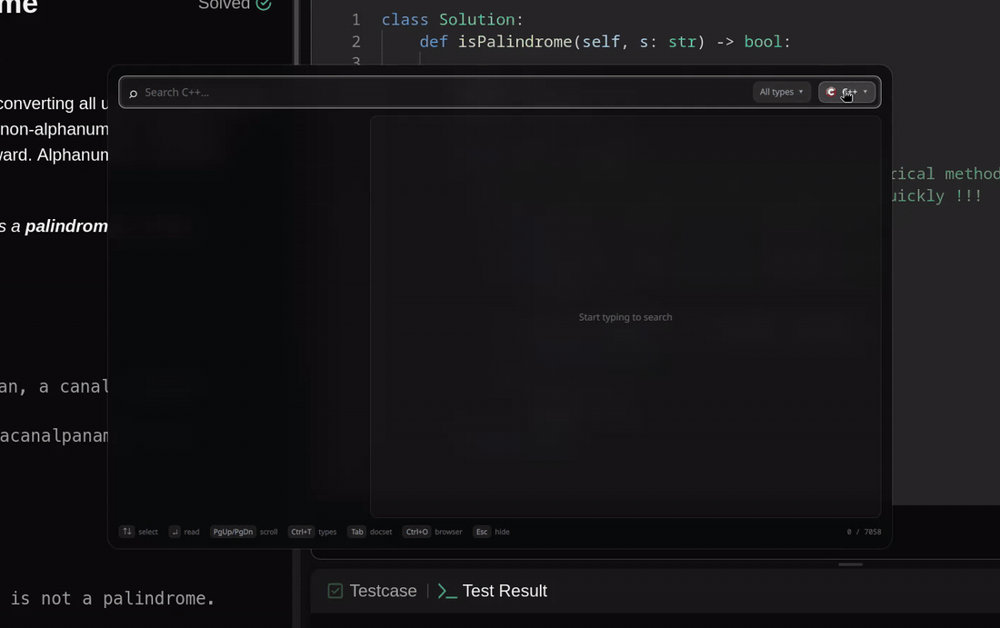
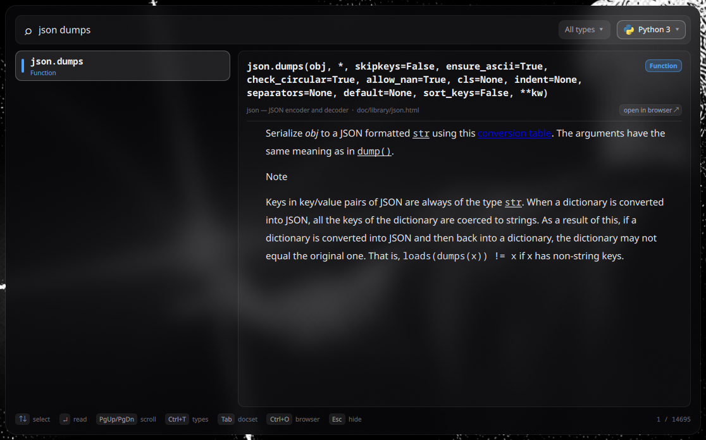
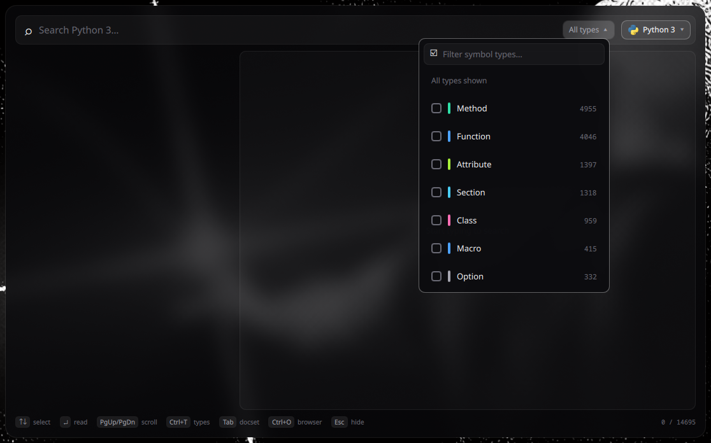
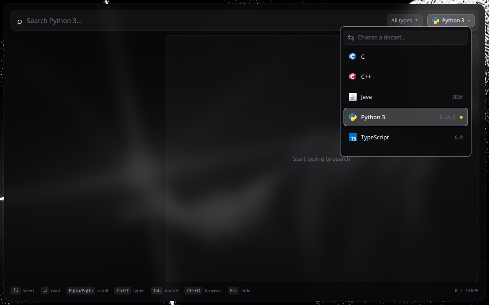

# Syntax Search

Offline documentation, one keypress away. Syntax Search is a keyboard-driven overlay for
Wayland that fuzzy-searches every symbol in your Dash/Zeal docsets and shows the
documentation right there in the panel — no browser, no network, no daemon to babysit.

[](docs/videodemo.mp4)

<sub>Solving a LeetCode problem and pulling up `str.isalnum` without leaving the editor —
[watch the full demo (mp4, 47 s)](docs/videodemo.mp4).</sub>



- **Instant fuzzy search** across tens of thousands of symbols (`vec push`, `json dumps`,
  `isalnum`); dotted symbols rank by their last segment, so `add` finds `set.add`.
- **Docs in-panel**: signature, type badge, page title and the full description — code
  blocks, lists and links included. Links navigate inside the panel; `Ctrl+O` opens the
  page in your browser when you want it.
- **Type filter**: show only Methods, Functions, Classes… with a checkbox dropdown.
- **Docset picker** with each docset's icon and version; the last choice is remembered.
- **Resident**: the first toggle starts it, every later toggle is instant and keeps your
  query, selection and scroll position.
- **Shell-agnostic**: a standalone [Quickshell](https://quickshell.org) app. Nothing
  depends on your bar, launcher or theme, so it survives swapping out your desktop shell.

<p>
  
  
</p>

## Requirements

| What | Why |
| --- | --- |
| A Wayland compositor with `wlr-layer-shell` (Hyprland, Sway, niri, river, …) | the overlay is a layer-shell surface |
| [Quickshell](https://quickshell.org) ≥ 0.3 (`qs`) | the only UI dependency |
| `python3` (standard library only) | reads the docset index and extracts the docs |
| `xdg-utils` (`xdg-open`) | "open in browser" |
| Docsets in `~/.local/share/Zeal/Zeal/docsets/` | easiest via [Zeal](https://zealdocs.org); or set `SYNTAX_SEARCH_DOCSETS=/path` |

## Install

```bash
git clone https://github.com/nickleigh05/syntax_search.git ~/Projects/syntax_search
cd ~/Projects/syntax_search
./install.sh            # add --with-zeal to install Zeal too
```

`install.sh` installs the dependencies (pacman / dnf / apt), verifies `qs`, `python3`
and `xdg-open` are on `PATH`, symlinks `bin/syntax-search` into `~/.local/bin`, and
prints the keybind snippet for your compositor. `./install.sh --uninstall` removes the
symlink.

### Getting docsets

Syntax Search doesn't ship documentation; it reads whatever docsets you have installed.
The easiest way to get them is Zeal's GUI:

```bash
zeal &          # open Zeal in the background
```

Then **Tools → Docsets → Available**, pick the languages you want (Python 3, C, C++,
Rust, TypeScript, …), click **Download**, and close Zeal — you don't need to keep it
running. New docsets show up in the picker (`Tab`) the next time you open the panel.
To add more later, just run `zeal &` again.

Docsets land in `~/.local/share/Zeal/Zeal/docsets/`; you can also drop `.docset`
bundles there by hand or point `SYNTAX_SEARCH_DOCSETS` at any folder of them.

## Usage

```
syntax-search            # toggle the panel (starts it on first use)
syntax-search --switch   # open the panel with the docset picker expanded
syntax-search --quit     # stop the resident instance
```

| Key | Action |
| --- | --- |
| type | fuzzy filter — space-separated words must all match |
| `↑` `↓` / `Ctrl+J` `Ctrl+K` | move selection; the doc pane follows |
| `Enter` | focus the doc pane (`↑` `↓` `PgUp` `PgDn` `Space` `Home` `End` scroll it) |
| `PgUp` `PgDn` | scroll the doc pane without leaving the search box |
| `Ctrl+T` | type filter — tick the symbol types to show; `Ctrl+⌫` clears |
| `Tab` | docset picker (clicking the pill works too) |
| `Ctrl+O` | open the current page in your browser |
| `Esc` | back to the search box, then hide the panel |

## Keybindings

Compositors usually launch binds with a minimal `PATH` that does not include
`~/.local/bin`, so bind the **absolute path**.

**Hyprland** (`hyprland.conf`)

```ini
bind = SUPER, slash, exec, /home/you/.local/bin/syntax-search
bind = SUPER SHIFT, slash, exec, /home/you/.local/bin/syntax-search --switch
layerrule = blur, syntax-search
layerrule = ignorealpha 0.3, syntax-search
```

**Hyprland** (Lua config)

```lua
local syntaxSearch = os.getenv("HOME") .. "/.local/bin/syntax-search"
hl.bind(mainMod .. " + slash", hl.dsp.exec_cmd(syntaxSearch))
hl.bind(mainMod .. " + SHIFT + slash", hl.dsp.exec_cmd(syntaxSearch .. " --switch"))
hl.layer_rule({ name = "syntax-search-blur", match = { namespace = "syntax-search" }, blur = true, ignore_alpha = 0.3 })
```

**Sway**

```
bindsym $mod+slash exec ~/.local/bin/syntax-search
bindsym $mod+Shift+slash exec ~/.local/bin/syntax-search --switch
```

**niri**

```kdl
Mod+Slash { spawn "/home/you/.local/bin/syntax-search"; }
Mod+Shift+Slash { spawn "/home/you/.local/bin/syntax-search" "--switch"; }
```

## Docsets

Syntax Search reads standard Dash/Zeal bundles: `<Name>.docset/Contents/Resources/docSet.dsidx`
(both the `searchIndex` and the older Apple `ZTOKEN` schemas). The docset's `meta.json`
provides the title and version shown in the UI, and `icon.png` / `icon@2x.png` the icon.

Some Zeal downloads are **tarix** docsets that ship their HTML inside `tarix.tgz` instead
of a `Documents/` folder. Those are extracted once into
`~/.cache/syntax-search/extracted/<docset>/` on first use (re-extracted if the archive
changes); delete that folder to reclaim space.

The active docset is stored in `~/.cache/syntax-search/current_docset`.

## Appearance

Colors and sizes live in [`qml/Theme.qml`](qml/Theme.qml): a dark translucent glass with
white selection/focus accents and a vivid color per symbol type. Edit, then
`syntax-search --quit` so the next toggle starts the new code. On Hyprland add the layer
rule above so the compositor blurs whatever is behind the panel.

## How it works

```
bin/syntax-search ──(qs ipc call panel toggle)──▶ shell.qml (resident PanelWindow)
                                                    │
        docset_index.py ◀── Process/StdioCollector ─┤ SearchPanel.qml   ranking, type filter, docset pill
        --symbols  → [[name, type, path], …]        │ ResultList.qml    matches
        --describe → {signature, html, summary}     │ DetailPane.qml    rich-text reader
        --list-docsets / --set-active               │ DocsetMenu.qml    picker
                                                    └ TypeFilterMenu.qml
```

- **Backend** (`docset_index.py`, stdlib only): lists docsets, dumps a docset's symbol
  table as JSON, and for a given page+anchor extracts just that symbol's section — it
  finds the anchor (`id`, Dash `<a name>` anchors, Sphinx `dt`/`dd` pairs including
  overloads, headings), strips scripts/styles/permalinks, resolves relative links, and
  emits the subset of HTML that Qt's rich-text engine can render.
- **Frontend** (QML): loads the whole symbol table once per docset and ranks it in-process
  on every keystroke (debounced), so there is no process spawn per character. Selecting a
  symbol fetches its description (debounced, cached per session).
- **Rendering**: Qt `Text` in rich-text mode, not a web view. QtWebEngine can't run inside
  Quickshell, and plain text would lose code blocks and links; the HTML subset is the
  sweet spot.
- **Lifecycle**: the wrapper first tries `qs -p … ipc call panel toggle`; if no instance
  answers it starts one detached with `setsid`. Hiding just unmaps the layer surface.

## Development

```bash
python3 -m unittest discover -s tests -v     # backend tests (synthetic docsets, no Zeal needed)
python3 docset_index.py --list-docsets
python3 docset_index.py --symbols Python_3 | head -c 300
python3 docset_index.py --describe Python_3 'doc/library/json.html#json.dumps' --name=json.dumps
```

CI runs the backend tests, `bash -n` and `shellcheck`. QML is not linted in CI because
Quickshell isn't available on the runners; after editing QML run `syntax-search --quit`
and toggle again — errors show up in `~/.cache/syntax-search/last.log`.

## Troubleshooting

- **The keybind does nothing** → bind the absolute path (see Keybindings), then check
  `~/.cache/syntax-search/last.log`.
- **"No docsets found"** → confirm `*.docset/Contents/Resources/docSet.dsidx` exists under
  the docsets directory, or set `SYNTAX_SEARCH_DOCSETS`.
- **Old UI after editing QML** → `syntax-search --quit`, then toggle again.
- **Blur missing** → the layer rule only exists on Hyprland; other compositors show the
  plain translucent tint.

## Known limitations

- The panel opens on the compositor's default output; multi-monitor placement isn't
  configurable yet.
- Entries of type Section/Guide are prose pages; the reader shows the section under the
  heading, which can be long.
- Blur is Hyprland-only (see above).
